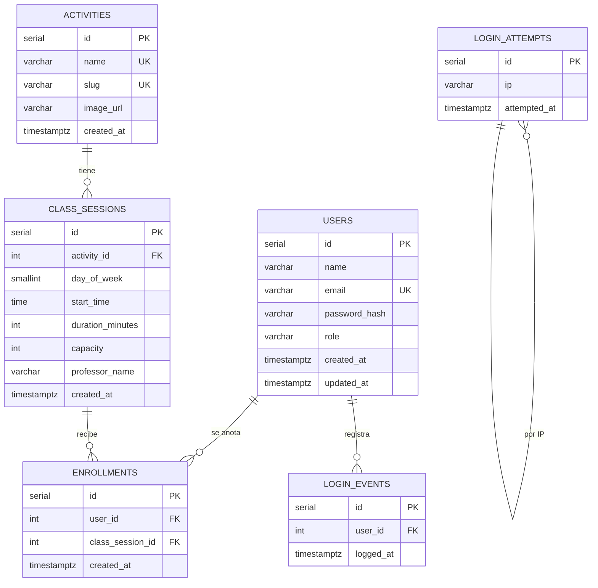

# MER — FitPower

Modelo Entidad-Relación de la base de datos PostgreSQL del proyecto.

## Diagrama

## Entidades

### USERS (Usuario)
Persona que inicia sesión en la app.

| Atributo | Tipo | Notas |
| --- | --- | --- |
| id | SERIAL PK | |
| name | VARCHAR(120) | Nombre visible en dashboard |
| email | VARCHAR(255) UNIQUE | Login |
| password_hash | VARCHAR(255) | Hash bcrypt/argon (`password_hash`) |
| role | VARCHAR(20) | `admin` \| `entrenador` \| `usuario` |
| created_at / updated_at | TIMESTAMPTZ | |

### ACTIVITIES (Actividad)
Disciplina del gimnasio (Boxeo, Pilates, etc.).

| Atributo | Tipo | Notas |
| --- | --- | --- |
| id | SERIAL PK | |
| name | VARCHAR(80) UNIQUE | |
| slug | VARCHAR(80) UNIQUE | Identificador URL |
| image_url | VARCHAR(255) | Imagen de la card |
| created_at | TIMESTAMPTZ | |

### CLASS_SESSIONS (Clase / horario)
Instancia programable de una actividad en un día/hora.

| Atributo | Tipo | Notas |
| --- | --- | --- |
| id | SERIAL PK | |
| activity_id | FK → ACTIVITIES | |
| day_of_week | SMALLINT 1–7 | 1=LUN … 7=DOM |
| start_time | TIME | |
| duration_minutes | INT | Default 60 |
| capacity | INT | Cupos máximos |
| professor_name | VARCHAR(120) | |
| created_at | TIMESTAMPTZ | |

### ENROLLMENTS (Inscripción)
Relación N:M entre usuario y clase.

| Atributo | Tipo | Notas |
| --- | --- | --- |
| id | SERIAL PK | |
| user_id | FK → USERS | |
| class_session_id | FK → CLASS_SESSIONS | |
| created_at | TIMESTAMPTZ | |
| UNIQUE(user_id, class_session_id) | | Evita doble inscripción |

### LOGIN_EVENTS
Auditoría de logins exitosos (contador semanal del dashboard).

### LOGIN_ATTEMPTS
Intentos fallidos por IP (rate limiting).

## Cardinalidades

- Un **USER** tiene muchas **ENROLLMENTS** (0..N).
- Una **CLASS_SESSION** tiene muchas **ENROLLMENTS** (0..N).
- Una **ACTIVITY** tiene muchas **CLASS_SESSIONS** (1..N típico).
- Un **USER** genera muchos **LOGIN_EVENTS**.

## Roles de negocio

| role | Uso |
| --- | --- |
| admin | Administración |
| entrenador | Personal del gimnasio |
| usuario | Socio / cliente del dashboard |

## Archivos relacionados

- Migraciones: `api/database/migrations/`
- Seed: `api/database/seed.php`
